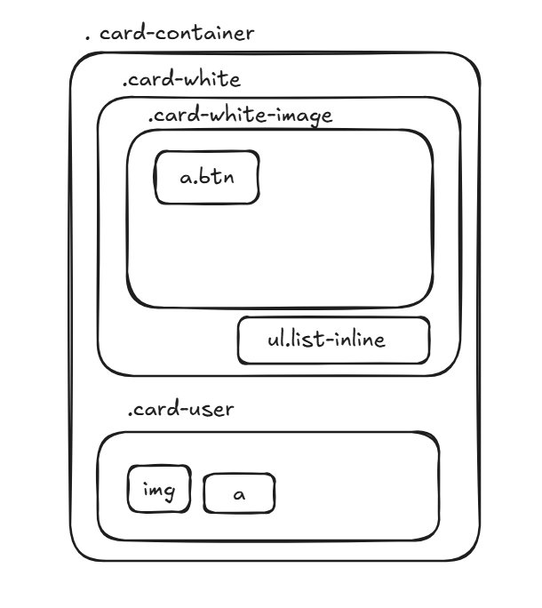

# Dribbble Card — CSS Component Exercise

A copycat of a [Dribbble](https://dribbble.com) card built with pure HTML and CSS. This project is part of the **Le Wagon Web Development Bootcamp**.

🔗 **Live demo:** https://lewagon.github.io/dribbble-card-solution/index

---

## What you'll learn from this project

- How to break a UI into **components** and think in terms of boxes inside boxes
- How to **organise CSS** across multiple files (one file per component)
- How to use a `<div>` with `background-image` instead of `` — and why
- Your first taste of **Flexbox** for aligning elements side by side
- How to build a **hover effect** using `opacity` and `transition`

---

## 📐 Always draw before you code

Before writing a single line of HTML, draw the structure of your component. HTML is just **boxes inside boxes** — if you can draw it, you can code it.

This is the drawing for this project:



Each box in the drawing becomes an HTML element with a class name. The nesting in the drawing becomes nesting in the code. Once you have this drawing, the HTML almost writes itself.

**Use [Excalidraw](https://excalidraw.com)** — it's a free browser-based drawing tool, perfect for this kind of sketch. No account needed, just open it and start drawing boxes. It's what your instructors use during live coding sessions and what you'll see on whiteboards throughout the bootcamp.

> 💡 This habit — draw first, code second — is not just for beginners. Professional developers do this every time they start a new component or feature. It forces you to think about structure before getting lost in syntax.

---

## File structure

```
├── index.html
└── css/
    ├── style.css              ← main stylesheet (linked in HTML)
    └── components/
        ├── card.css           ← styles for the card component only
        └── button.css         ← styles for the button component only
```

### Why multiple CSS files?

`index.html` only links to one file — `style.css`. But `style.css` uses `@import` to load the component files:

```css
@import url("components/card.css");
@import url("components/button.css");
```

This is called **component-based CSS organisation**. Instead of writing all your CSS in one giant file, you split it by component. If something looks wrong with the card, you know exactly where to look: `card.css`. This is how real development teams work.

---

## Key CSS concepts used

### `background-image` on a `<div>` (not ``)

The image area is a `<div>`, not an `` tag:

```html
<div class="card-white-image" style="background-image: url('...');">
  <a href="" class="btn">Save</a>
</div>
```

Why? Because we need to put a button **inside** the image area. You can't nest HTML elements inside an `` tag, but you can inside a `<div>`.

> ⚠️ When using `background-image` on a div, you **must** set a `height`. Divs are 0px tall by default, so without a height the image area is invisible.

```css
.card-white-image {
  background-size: cover;      /* fills the box without distorting the image */
  background-position: center; /* crops from the center, not the corner */
  height: 150px;               /* required! */
}
```

---

### Flexbox for side-by-side alignment

Flexbox is used in two places:

**1. The grid of cards:**
```css
.cards {
  display: flex;
  flex-wrap: wrap;
  justify-content: space-between;
}
```

**2. The avatar + username row:**
```css
.card-user {
  display: flex;
  align-items: center; /* vertically centers the avatar and the text */
}
```

`display: flex` on a **parent** element makes all its direct children sit side by side. `align-items: center` vertically aligns them along their midpoints.

---

### The hover effect

The "Save" button is invisible by default and fades in when you hover over the card:

```css
/* Hidden by default */
.card-white .btn {
  opacity: 0;      /* invisible, but still in the page */
  transition: .3s; /* any change will animate over 0.3 seconds */
}

/* Visible when the card is hovered */
.card-white:hover .btn {
  opacity: 1;
}
```

`opacity: 0` is **not** the same as `display: none`. The element is still there — just fully transparent. This lets us animate the reveal using `transition`.

---

### Making a circle with `border-radius`

```css
.avatar {
  border-radius: 50%; /* turns any square element into a circle */
  width: 30px;
}
```

Any element with `border-radius: 50%` becomes a circle, as long as it has equal width and height (or is a square image).

---

### Descendant selectors

```css
.card-white .list-inline { ... }
```

The **space** between `.card-white` and `.list-inline` means "only target `.list-inline` elements that are **inside** a `.card-white`". This prevents styles from accidentally affecting other lists elsewhere on the page.

---

## How to run this project locally

**1. Clone the repository**

```bash
git clone https://github.com/<your-username>/dribbble-card.git
cd dribbble-card
```

**2. Start a local server**

Inside the project folder, run:

```bash
serve
```

Then open your browser and go to the URL shown in your terminal (usually `http://localhost:3000`).

**3. Workflow while coding**

Every time you save a change in your editor, just go to the browser and hit **Cmd+R** (Mac) or **Ctrl+R** (Windows/Linux) to refresh the page and see your changes.

---

> **Why not just open index.html directly?**
>
> You *can* open `index.html` by double-clicking it, and for basic HTML it works fine. But as soon as your project uses `@import` in CSS, fetches fonts from Google, loads Font Awesome, or later when you use JavaScript — the browser blocks those requests when the file is opened directly from your filesystem (you'll see a `file://` URL in the address bar instead of `http://`). This is a browser security restriction called CORS. Running a local server avoids all of that and mimics how a real website works.

---

## Challenge ideas

Once you understand the project, try extending it:

- [ ] Add a fourth card with a different image
- [ ] Change the hover button style — different color, different text
- [ ] Add a `box-shadow` to `.card-white` so the card looks lifted off the page
- [ ] Make the image zoom in slightly on hover using `transform: scale(1.05)` and `overflow: hidden`
- [ ] Add your own username and a real avatar image

---

## External tools and resources used

### Font Awesome — icons as HTML tags

Font Awesome is a library that lets you use thousands of icons in your HTML using nothing but a CSS class. You don't download any image files — the icons are delivered as a font, which means they scale perfectly at any size and you can colour them with plain CSS.

**How to import it**

Add this `@import` line at the top of your `style.css`, before any other rules:

```css
@import url("https://use.fontawesome.com/releases/v6.1.2/css/all.css");
```

That's it. The browser fetches the icon font from Font Awesome's servers automatically.

**How to use an icon in HTML**

Use an `<i>` tag with two classes: `fas` (solid style) and the icon name prefixed with `fa-`:

```html
<i class="fas fa-heart"></i>   <!-- ❤️ heart -->
<i class="fas fa-eye"></i>     <!-- 👁 eye -->
<i class="fas fa-comment"></i> <!-- 💬 comment -->
```

**How to change the size and colour**

Icons inherit the `font-size` and `color` of their parent element, so you can style them with plain CSS:

```css
/* make the icon bigger */
.fas {
  font-size: 24px;
}

/* change the colour */
.fa-heart {
  color: red;
}
```

**Finding more icons**

Browse the full library at [fontawesome.com/icons](https://fontawesome.com/icons) — search by name and click any icon to get the exact class names to use.

---

### Lorem Flickr — placeholder images

[loremflickr.com](https://loremflickr.com) generates real photographs on demand. Instead of downloading and storing image files, you just build a URL and paste it directly into your HTML or CSS. The image loads live from their server.

**URL structure**

```
https://loremflickr.com/{width}/{height}/{keyword}
```

| Part | What it does |
|---|---|
| `{width}` | image width in pixels |
| `{height}` | image height in pixels |
| `{keyword}` | search term — any word you like |

**Examples**

```html
<!-- a 320×240 photo of a cat -->


<!-- a 600×400 photo of mountains -->


<!-- used as a CSS background-image -->
<div style="background-image: url('https://loremflickr.com/320/240/city');"></div>
```

**⚠️ Square images for round avatars**

This is important: `border-radius: 50%` only produces a perfect circle if the original image is **square** (equal width and height). If the image is rectangular, you get an oval instead.

```
✅  loremflickr.com/240/240/dog   ← square → becomes a perfect circle
❌  loremflickr.com/320/240/dog   ← rectangle → becomes an oval
```

Always use the same number for both width and height when the image is going to be used as an avatar:

```html
<!-- correct: square image for a round avatar -->

```

```css
.avatar {
  border-radius: 50%; /* works perfectly because the source image is square */
  width: 30px;
  height: 30px;
}
```

> 💡 The `width` and `height` in the URL control the image file that gets downloaded. The `width` and `height` in CSS control how large the browser *displays* it. You can download a 240×240 image and display it at 30×30 — the browser scales it down. What matters for the circle shape is that both CSS dimensions are equal.

---

## Credits

Built during the **Le Wagon Web Development Bootcamp** as part of the HTML & CSS module.
Inspired by [Dribbble](https://dribbble.com).
Placeholder images from [Lorem Flickr](https://loremflickr.com).
Icons from [Font Awesome](https://fontawesome.com).